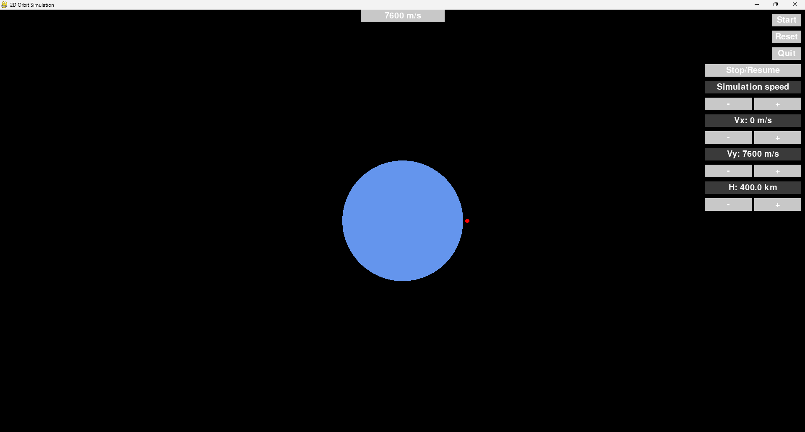

# Praca zaliczeniowa przedmiotu WFIT 25L 
# Bartosz Woźniak 337409, Jakub Falba 333234 
## Symulacja wzajemnego oddziaływania siły grawitacji między planetą a satelitą
Program w języku Python, który napisaliśmy, jest prostą symulacją ruchu satelity wokół Ziemi - bazując na podstawowych prawach fizyki. 

Do jej realizacji użyliśmy biblioteki Pygame, która służy do tworzenia grafik 2D i obsługi interfejsów.


## ⚙️ Wymagania

- Python w wersji 3.7 lub nowszej
- Biblioteka **Pygame**


## ▶️ Uruchomienie
Aby uruchomić program, wykonaj w terminalu poniższe polecenie (w katalogu z plikiem)
```bash
    python main.py
```


## 🔎 Podgląd GUI



## 🎮 Sterowanie i elementy interfejsu

| Przycisk              | Funkcja                                      |
|----------------------|---------------------------------------------|
| **Start**            | Uruchamia symulację                          |
| **Reset**            | Resetuje pozycję i prędkość satelity          |
| **Quit**             | Kończy działanie programu                    |
| **Stop/Resume**      | Zatrzymuje lub wznawia animację              |
| **Simulation Speed +** | Zwiększa prędkość przebiegu czasu (dt i FPS) |
| **Simulation Speed -** | Zmniejsza prędkość przebiegu czasu (dt i FPS)|
| **Vx +/-**       | Zwiększa/zmniejsza prędkość poziomą satelity         |
| **Vy +/-**       | Zwiększa/zmniejsza prędkość pionową satelity         |
| **H +/-**       | Zwiększa/zmniejsza odległość satelity od powierzchnii Ziemi        |
| **Scroll myszy**     | Zmienia skalę widoku (zoom in/zoom out)      |
| **Aktualna prędkość (wyświetlana)** | Pokazuje aktualną wartość prędkości satelity w m/s na górze ekranu |


